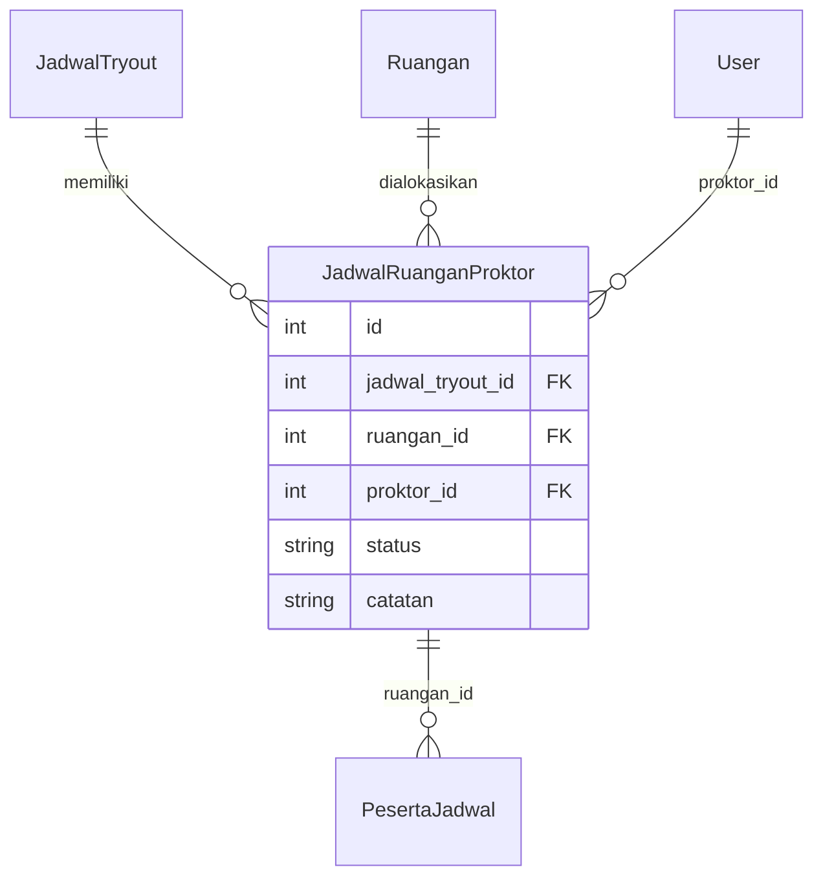

# 44. Konsep & Implementation Plan: Integrasi Ruangan & Proktor

**Tanggal**: 22 Maret 2026  
**Status**: ✅ Disetujui — Belum Dieksekusi

---

## 🎯 Tujuan

Mengintegrasikan dua menu yang sudah ada (Ruangan & Proktor) ke dalam alur ujian:
1. **Proktor** — akun pengawas diberi akses monitoring dan di-assign ke ruangan
2. **Ruangan** — master data ruang ujian ditempel ke jadwal & proktor

---

## ✅ Keputusan yang Sudah Disetujui

- **Set/Unset Token**: **Opsi B - Admin & Proktor**
  *   *Keputusan*: Proktor **DIBERIKAN** izin untuk Set/Unset token rilis demi fleksibilitas pembagian token di ruangan masing-masing. (Revisi per user: 22 Mar 2026)
  *   *Catatan*: Token yang rilis tetap bersifat global/sesuai jadwal.
| No | Keputusan | Hasil |
|:---|:----------|:------|
| 2 | 1 Ruangan = berapa Proktor? | **1 proktor cukup**, tapi tanpa unique constraint agar bisa ditambah ke depan. 1 proktor bisa 2+ ruangan |
| 3 | Auto-distribute peserta ke ruangan? | **Ya — Prioritas Tinggi** (Fase 2) |
| 4 | Dashboard khusus Proktor? | **Fitur masa depan** (lihat file 45) |
| 5 | Log kegiatan Proktor? | **Tabel baru terpisah** (Fase 3) |
| 6 | Kolom `status` di tabel pivot? | **Ya** — untuk histori penggantian proktor tanpa hapus data |

---

## 📊 Kondisi Saat Ini (As-Is)

### Ruangan
| Aspek | Status |
|:------|:-------|
| Tabel `ruangan` | ✅ Sudah ada (`sekolah_id`, `nama_ruangan`, `kode_ruangan`, `kapasitas`) |
| Model `Ruangan` | ✅ Sudah ada, relasi ke `Sekolah` dan `PesertaJadwal` |
| `RuanganResource` | ✅ Sudah ada (CRUD dasar) |
| Kolom `ruangan_id` di `peserta_jadwal` | ✅ Sudah ada (nullable FK) |
| Alokasi peserta ke ruangan | ❌ Belum ada mekanisme assign |
| Relasi ke Jadwal Ujian | ❌ Belum ada |
| Relasi ke Proktor | ❌ Belum ada |

### Proktor
| Aspek | Status |
|:------|:-------|
| User role `proktor` | ✅ Sudah ada di tabel `users` |
| `ProktorResource` | ✅ Sudah ada (CRUD akun) |
| Permission `manage_monitoring` | ✅ Sudah ada via Spatie |
| Akses ke menu Monitoring Ujian | ✅ Sudah bisa (via `canAccess()`) |
| Assignment ke ruangan tertentu | ❌ Belum ada |
| Assignment ke jadwal tertentu | ❌ Belum ada |
| Filter data monitoring per ruangan | ❌ Belum ada |

---

## 🏗️ Desain: Tabel Pivot `jadwal_ruangan_proktor`

Tabel pivot yang menghubungkan **Jadwal ↔ Ruangan ↔ Proktor** dalam satu tabel penugasan:

| Kolom | Tipe | Keterangan |
|:------|:-----|:-----------|
| `id` | BigInt (PK) | Auto-increment |
| `jadwal_tryout_id` | BigInt (FK) | Relasi ke `jadwal_tryout` |
| `ruangan_id` | BigInt (FK) | Relasi ke `ruangan` |
| `proktor_id` | BigInt (FK, Nullable) | Relasi ke `users` (role=proktor) |
| `status` | Enum (active/inactive) | Untuk histori penggantian tanpa hapus data |
| `catatan` | Text (Nullable) | Catatan khusus |
| `created_at`, `updated_at` | Timestamp | - |

> [!IMPORTANT]
> Tidak ada unique constraint pada `(jadwal_tryout_id, ruangan_id)` — fleksibel untuk multi-proktor atau histori penggantian di masa depan.

### Diagram Relasi



### Alur Kerja

```
1. Admin membuat JADWAL TRYOUT (sudah ada)
2. Admin memilih RUANGAN untuk jadwal → via Relation Manager
3. Admin menugaskan PROKTOR ke ruangan → via Relation Manager
4. Admin mengalokasikan PESERTA ke ruangan (Fase 2: auto-distribute)
5. Proktor LOGIN → monitoring otomatis terisolasi per ruangan
```

---

## 📋 Roadmap Implementasi

### 🔵 Fase 1 — Core

#### Langkah 1: Migration — Tabel `jadwal_ruangan_proktor`

```bash
php artisan make:migration create_jadwal_ruangan_proktor_table
```

Isi migration:
```php
Schema::create('jadwal_ruangan_proktor', function (Blueprint $table) {
    $table->id();
    $table->foreignId('jadwal_tryout_id')->constrained('jadwal_tryout')->onDelete('cascade');
    $table->foreignId('ruangan_id')->constrained('ruangan')->onDelete('cascade');
    $table->foreignId('proktor_id')->nullable()->constrained('users')->onDelete('set null');
    $table->enum('status', ['active', 'inactive'])->default('active');
    $table->text('catatan')->nullable();
    $table->timestamps();
});
```

---

#### Langkah 2: Model `JadwalRuanganProktor`

Buat file `app/Models/JadwalRuanganProktor.php`:

```php
class JadwalRuanganProktor extends Model
{
    protected $table = 'jadwal_ruangan_proktor';

    protected $fillable = [
        'jadwal_tryout_id', 'ruangan_id', 'proktor_id', 'status', 'catatan',
    ];

    public function jadwalTryout()
    {
        return $this->belongsTo(JadwalTryout::class);
    }

    public function ruangan()
    {
        return $this->belongsTo(Ruangan::class);
    }

    public function proktor()
    {
        return $this->belongsTo(User::class, 'proktor_id');
    }

    public function scopeActive($query)
    {
        return $query->where('status', 'active');
    }
}
```

---

#### Langkah 3: Tambah Relasi di Model yang Ada

**`JadwalTryout.php`** — tambah:
```php
public function ruanganProktors()
{
    return $this->hasMany(JadwalRuanganProktor::class);
}
```

**`Ruangan.php`** — tambah:
```php
public function jadwalProktors()
{
    return $this->hasMany(JadwalRuanganProktor::class);
}
```

**`User.php`** — tambah:
```php
public function penugasanRuangan()
{
    return $this->hasMany(JadwalRuanganProktor::class, 'proktor_id');
}

public function isProktor(): bool
{
    return $this->role === 'proktor';
}
```

---

#### Langkah 4: Update `canAccessPanel()` di `User.php`

Proktor harus bisa login ke Filament panel. Ubah:

```diff
 public function canAccessPanel(Panel $panel): bool
 {
-    return in_array($this->role, ['super_admin', 'admin']);
+    return in_array($this->role, ['super_admin', 'admin', 'proktor']);
 }
```

---

#### Langkah 5: Update `RolePermissionSeeder.php`

Tambahkan role `proktor` dan assign permission:

```diff
  $superAdmin = Role::firstOrCreate(['name' => 'super_admin']);
  $admin      = Role::firstOrCreate(['name' => 'admin']);
  $peserta    = Role::firstOrCreate(['name' => 'peserta']);
+ $proktor    = Role::firstOrCreate(['name' => 'proktor']);

  $superAdmin->syncPermissions(Permission::all());
+ $proktor->syncPermissions(['manage_monitoring']);
```

Jalankan: `php artisan db:seed --class=RolePermissionSeeder`

---

#### Langkah 6: Buat `RuanganProktorRelationManager`

File: `app/Filament/Resources/JadwalTryoutResource/RelationManagers/RuanganProktorRelationManager.php`

Fitur:
- **Tabel**: Kolom Ruangan, Proktor, Status (badge), Catatan
- **Form Create/Edit**: Select ruangan (filter per sekolah jadwal), Select proktor (filter per sekolah jadwal, role=proktor), Status, Catatan
- **Actions**: Edit, Toggle Status (active ↔ inactive)
- Proktor yang berstatus `inactive` tetap terlihat di histori tapi tidak dipakai untuk isolasi data

---

#### Langkah 7: Buat `ViewJadwalTryout` Page

File: `app/Filament/Resources/JadwalTryoutResource/Pages/ViewJadwalTryout.php`
- Extends `ViewRecord`
- Diperlukan agar Relation Manager bisa tampil (Filament butuh View page)

---

#### Langkah 8: Register di `JadwalTryoutResource.php`

```diff
  public static function getRelations(): array
  {
      return [
-         //
+         RelationManagers\RuanganProktorRelationManager::class,
      ];
  }

  public static function getPages(): array
  {
      return [
          'index' => Pages\ListJadwalTryouts::route('/'),
          'create' => Pages\CreateJadwalTryout::route('/create'),
+         'view' => Pages\ViewJadwalTryout::route('/{record}'),
          'edit' => Pages\EditJadwalTryout::route('/{record}/edit'),
      ];
  }
```

---

#### Langkah 9: Isolasi Data & Aksi Proktor di Semua Halaman Monitoring

Semua halaman monitoring harus **difilter** berdasarkan ruangan yang ditugaskan ke proktor. Proktor bisa melakukan aksi-aksi tertentu, tapi **hanya untuk peserta di ruangannya**.

**Logic filter (diterapkan di SEMUA halaman berikut):**
```php
$user = auth()->user();
if ($user->role === 'proktor') {
    $assignedRuanganIds = \App\Models\JadwalRuanganProktor::where('proktor_id', $user->id)
        ->where('status', 'active')
        ->whereIn('jadwal_tryout_id', $activeJadwalIds)
        ->pluck('ruangan_id');

    $query->whereIn('ruangan_id', $assignedRuanganIds);
}
```

**Detail per halaman:**

| Halaman | File | Aksi yang Bisa Dilakukan Proktor | Batasan |
|:--------|:-----|:--------------------------------|:--------|
| **Status Peserta** | `StatusPeserta.php` | ✅ Lihat status peserta, ✅ Force Submit (Selesai Tes Paksa) | Hanya peserta di ruangannya |
| **Daftar Peserta** | `DaftarPeserta.php` | ✅ Lihat daftar peserta, filter per kelompok | Hanya peserta di ruangannya |
| **Kelompok Tes** | `KelompokTes.php` | ✅ Assign (aktifkan peserta), ✅ Unassign (nonaktifkan peserta), ✅ Reset All | Hanya peserta di ruangannya |
| **Daftar Login** | `DaftarLogin.php` | ✅ Reset Login (per peserta), ✅ Reset Login Massal | Hanya peserta di ruangannya |
| **Request Reset** | `RequestReset.php` | ✅ Approve/Reject permintaan reset dari peserta | Hanya peserta di ruangannya |
| **Status Tes** | `StatusTes.php` | ✅ Lihat Token (read-only, bisa copy), ❌ **TIDAK BISA** Set/Unset Token | Token ditampilkan tapi tombol aksi disembunyikan |

**File yang dimodifikasi (6 file):**
- `app/Filament/Pages/StatusPeserta.php` — tambah filter ruangan
- `app/Filament/Pages/DaftarPeserta.php` — tambah filter ruangan
- `app/Filament/Pages/KelompokTes.php` — tambah filter ruangan
- `app/Filament/Pages/DaftarLogin.php` — tambah filter ruangan
- `app/Filament/Pages/RequestReset.php` — tambah filter ruangan
- `app/Filament/Pages/StatusTes.php` — tambah filter ruangan + hide Set/Unset action:

```php
// Sembunyikan tombol Set/Unset Token untuk proktor
->visible(fn () => auth()->user()->role !== 'proktor')
```

> [!IMPORTANT]
> Prinsip: **Proktor bisa melakukan semua aksi monitoring yang sama dengan Admin**, kecuali Set/Unset Token. Perbedaannya hanya pada **scope data** — proktor hanya melihat dan mengelola peserta di ruangan yang ditugaskan.

---

> [!TIP]
> **💡 Tips Teknis: DRY Principle Menggunakan Trait**
> Untuk menghindari pengulangan logic `whereIn` pada 6 file monitoring, sangat disarankan untuk membuat sebuah **Trait** agar kode lebih bersih (Clean Code) dan mudah dikelola.
>
> **1. Buat file Trait**: `app/Traits/HasProktorFilter.php`
> ```php
> namespace App\Traits;
> 
> use App\Models\JadwalRuanganProktor;
> use Illuminate\Database\Eloquent\Builder;
> 
> trait HasProktorFilter
> {
>     protected function applyProktorFilter(Builder $query): Builder
>     {
>         $user = auth()->user();
> 
>         if ($user->role === 'proktor') {
>             // Ambil ID Ruangan yang ditugaskan ke proktor ini (status aktif)
>             $assignedRuanganIds = JadwalRuanganProktor::where('proktor_id', $user->id)
>                 ->where('status', 'active')
>                 ->pluck('ruangan_id');
> 
>             return $query->whereIn('ruangan_id', $assignedRuanganIds);
>         }
> 
>         return $query;
>     }
> }
> ```
>
> **2. Gunakan di Halaman Monitoring** (Contoh di `StatusPeserta.php`):
> ```php
> use App\Traits\HasProktorFilter;
> 
> class StatusPeserta extends Page {
>     use HasProktorFilter;
> 
>     // Pada query builder, panggil trait ini:
>     // return $this->applyProktorFilter($query);
> }
> ```

---

> [!CAUTION]
> **🛡️ Catatan Keamanan pada Aksi Massal (Bulk Actions)**
> Pada halaman seperti Kelompok Tes atau Daftar Login, pastikan aksi massal (Bulk Actions) juga mengikuti filter tersebut. Filament secara default menjalankan aksi hanya pada record yang tampil (aman), namun pastikan:
> - **Action visible()**: Tombol "Set Token" benar-benar disembunyikan menggunakan `->visible(fn () => auth()->user()->role !== 'proktor')` agar UI Proktor bersih (Rekomendasi Utama).

---

## ⚠️ Hal Penting Sebelum Eksekusi

1. **Namespace Spatie (HasRoles)**: Pastikan di model `User.php` Anda sudah `use HasRoles` dari Spatie (agar method `$user->hasRole('proktor')` bekerja). *(Di codebase saat ini sudah ada ✅)*
2. **Indeks Kolom `ruangan_id`**: Pastikan kolom `ruangan_id` di tabel `peserta_jadwal` memiliki **database index** agar filter filter data monitoring tetap cepat saat data sudah mencapai ribuan peserta.
3. **Validasi Duplikasi**: Meskipun tidak ada unique constraint demi fleksibilitas, tambahkan validasi/peringatan di UI `RelationManager` apabila admin mencoba memilih ruangan yang sama di jadwal yang sama dua kali, agar tidak sengaja terpilih.

---

### 🟡 Fase 2 — Automasi

| No | Langkah | Deskripsi |
|:---|:--------|:----------|
| 1 | Auto-distribute peserta | Bulk action: 1 klik untuk bagi peserta ke ruangan berdasarkan kapasitas |
| 2 | Cetak denah & kartu | Update Kartu Login + PDF daftar peserta per ruangan |

---

### 🔴 Fase 3 — UX & Audit

| No | Langkah | Deskripsi |
|:---|:--------|:----------|
| 1 | Dashboard proktor | Widget Livewire ringkasan data ruangan hari ini |
| 2 | Log audit proktor | Tabel baru `proktor_activity_log` untuk catat aksi |

*(Detail Fase 3 & fitur masa depan lainnya → lihat file `45_Fitur_Masa_Depan_Ruangan_Proktor.md`)*

---

## ✅ Rencana Verifikasi (Setelah Eksekusi Fase 1)

1. **Migration**: `php artisan migrate` → tabel `jadwal_ruangan_proktor` terbentuk
2. **Seeder**: `php artisan db:seed --class=RolePermissionSeeder` → role proktor + permission
3. **CRUD Relation Manager**: Buka Jadwal Ujian → View → assign ruangan + proktor → berhasil
4. **Login Proktor**: Login `/admin` sebagai proktor → sidebar hanya Monitoring Ujian
5. **Isolasi Data**: Semua 6 halaman monitoring → hanya peserta di ruangan proktor yg tampil
6. **Aksi Proktor**: Assign/Unassign di Kelompok Tes, Reset Login, Force Submit → berfungsi tapi hanya untuk peserta di ruangannya
7. Token Read-Only: StatusTes → token terlihat, tombol Set/Unset tersembunyi

---

## 📊 Status Eksekusi (Progress)

### 🔵 Fase 1 — Core
- [x] **Langkah A: Fondasi Database & Model** *(Selesai — 22 Mar 2026)*
  - ✅ Migrasi `jadwal_ruangan_proktor` dijalankan
  - ✅ Model `JadwalRuanganProktor` dibuat
  - ✅ Relasi di `JadwalTryout`, `Ruangan`, `User` ditambahkan
  - 🛠️ **Fix Bug**: Migrasi `add_proktor_to_user_role_enum_table` dijalankan untuk menambah `'proktor'` ke enum `users.role` (mengatasi Error 1265).

- [x] **Langkah B: Hak Akses & Interface Admin** *(Selesai — 22 Mar 2026)*
  - ✅ Helper `isProktor()` & Perizinan Panel di `User.php` ditambahkan
  - ✅ Role `proktor` di `RolePermissionSeeder` dibuat & dijalankan
  - ✅ `RuanganProktorRelationManager` & Page `ViewJadwalTryout` dibuat & didaftarkan

- [x] **Langkah C: Pembatasan & Trait Monitoring** *(Selesai — 22 Mar 2026)*
  - ✅ Trait `HasProktorFilter` dibuat & diintegrasikan di 6 halaman monitoring
  - ✅ Query `StatusPeserta`, `DaftarPeserta`, `KelompokTes`, `DaftarLogin`, `RequestReset` terfilter per ruangan Proktor
  - ✅ Tombol aksi Token di `StatusTes` berhasil disembunyikan untuk Proktor (Read-only)
  - ✅ Verifikasi login & akses panel Proktor berhasil ditest via browser (Tanpa 500 error)

---
*Fase 1 Selesai. Menunggu persetujuan untuk melangkah ke Fase 2 (Automasi).*
```
